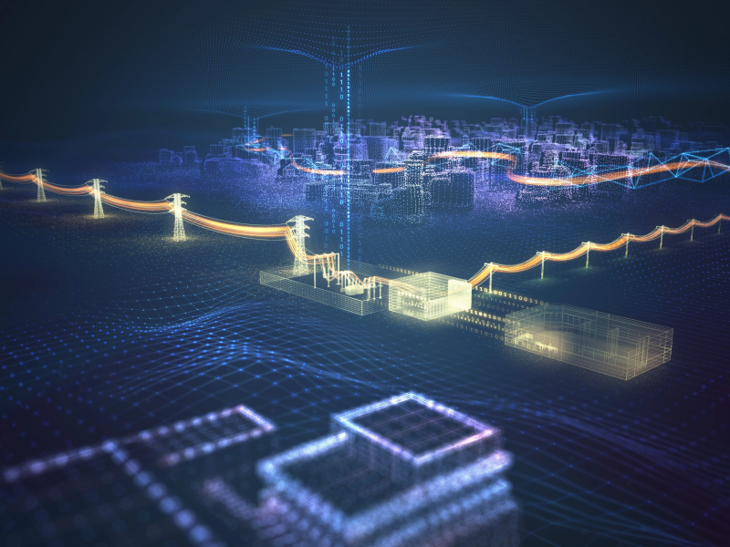
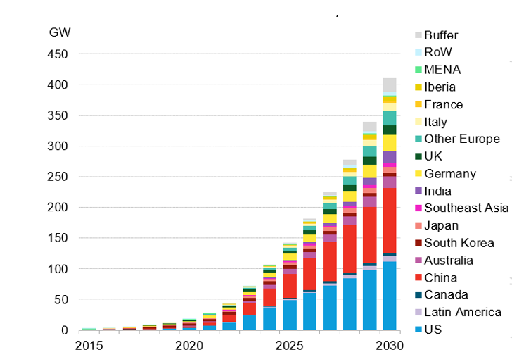
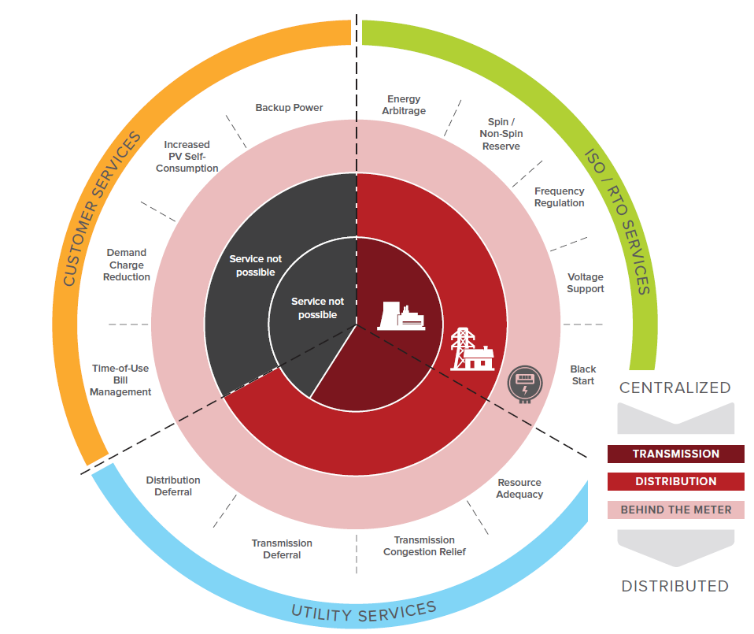
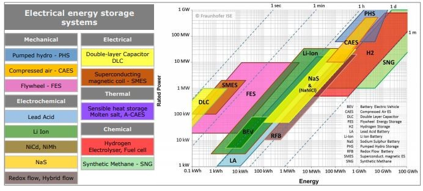
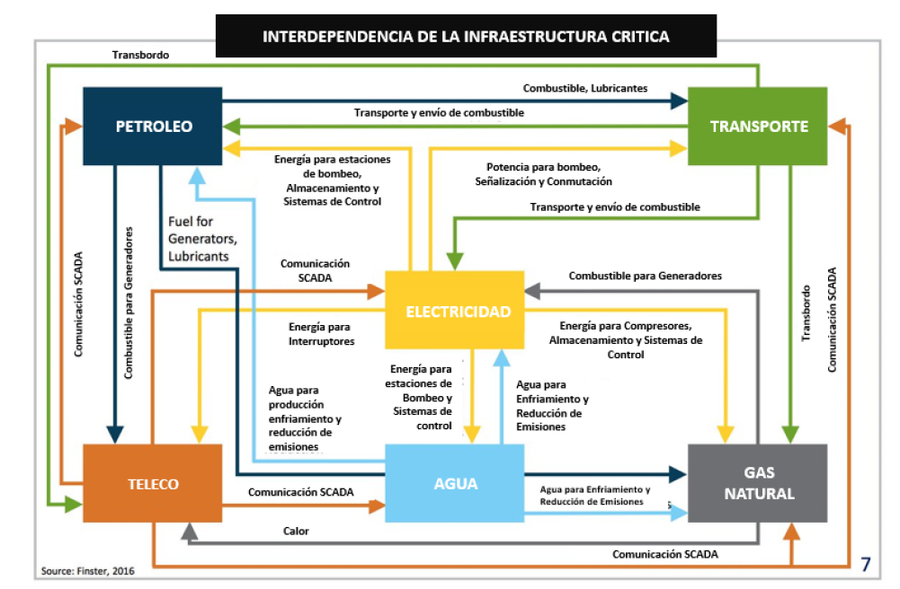
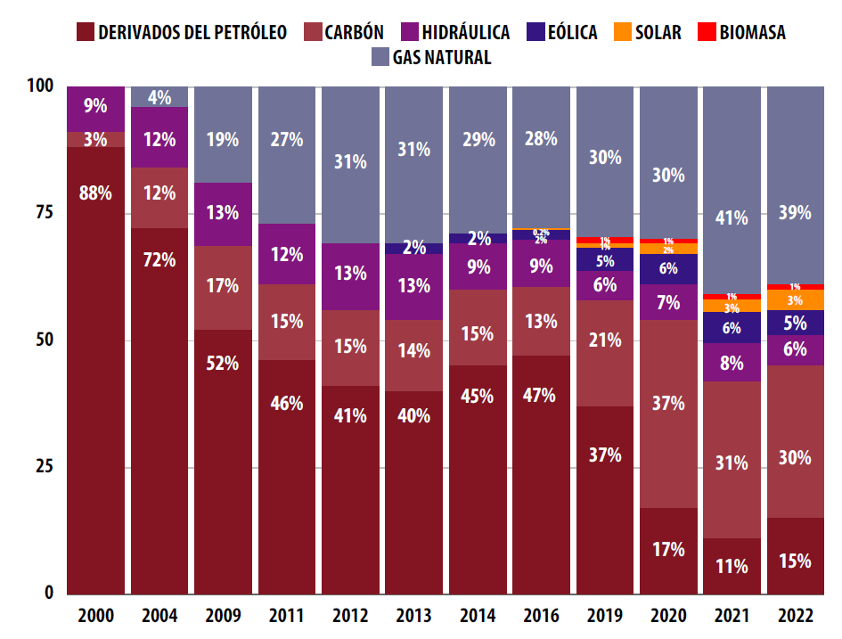
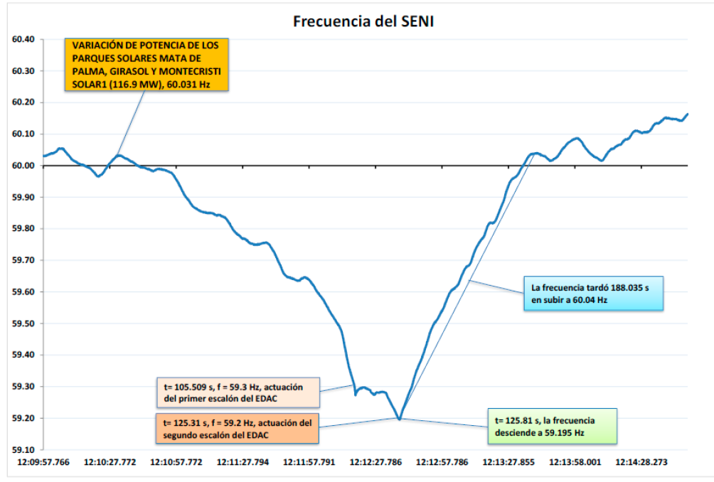
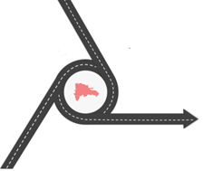

**Original publicado en** : https://hoy.com.do/almacenamiento-energia-resiliencia-e-independencia-en-rd/

El almacenamiento de energía se ha convertido en un tema cada vez más relevante en la discusión sobre la transición hacia sistemas energéticos más limpios y sostenibles. En el contexto de las naciones insulares, como es el caso de República Dominicana, estas tecnologías jugarán un rol aún más crucial en la búsqueda de resiliencia e independencia energética, que no es un asunto trivial cuando se mira desde la óptica de la inestabilidad geopolítica que supone el cambio climático, y la incertidumbre de los precios y el acceso a combustibles fósiles en tiempos de tensión bélica.

En la última semana del año 2022, la Comisión Nacional de Energía (CNE), órgano del estado dominicano que tiene como atribución elaborar, coordinar, proponer y adoptar políticas para el buen funcionamiento y desarrollo del sector energía, hizo público a través de su portal de transparencia un estudio sobre la integración de **Energías Renovables Variables y Sistemas de Energía Almacenamiento de Energía en Baterías** _(BESS por sus siglas en inglés),_ y los borradores de resoluciones que declaran estos como una necesidad inmediata en aras de anticiparse a la masiva penetración de recursos energéticos variables, y con el objetivo de mantener el buen funcionamiento del Sistema Eléctrico Nacional Interconectado (SENI). [1]

Las próximas líneas son una mirada al contexto global, a la oportunidad latente en nuestro país, y a las hipótesis de entrada que proponen los profesionales de la CNE para justificar sus argumentos.

**Almacenamiento: ¿El Santo Grial de la Energía?**

Uno de los fundamentos principales en los sistemas eléctricos de potencia es el hecho de que la electricidad **no se puede almacenar en grandes cantidades con facilidad** , como se hace con combustibles fósiles. No obstante, este es precisamente el reto de miles de ingenieros y científicos en todo el mundo. Al borde de una catástrofe climática incuestionable, hay una carrera global para encontrar formas de acomodar la cantidad cada vez mayor de energías renovables que se necesitarán para hacer la transición a una red de energía neutra en carbón. El almacenamiento de energía está en el centro de esta conversación.

La Agencia Internacional de Energías Renovables (IRENA), analizando los efectos de la transición energética hasta 2050, encontró que más del **80% de la electricidad mundial** podría derivarse de fuentes renovables para esa fecha. A medida que crezcan las energías renovables variables, la red requerirá una mayor flexibilidad. Se espera que la energía solar fotovoltaica (PV) y eólica representen **el 52% de la generación total de energía** , por lo que la electricidad deberá almacenarse no solo por horas, sino también por días y semanas. [2]

**Figura 1** – Acumulado de BESS 2015-2030 Fuente: BloombergNEF (2022)

Según el último pronóstico de la empresa de investigación de mercados BloombergNEF (BNEF), se proyecta que las instalaciones de almacenamiento de energía en todo el mundo alcancen **411 gigavatios acumulados** (o 1194 gigavatios-hora) para fines de 2030. Eso es 15 veces los 27 GW/56 GWh de almacenamiento que había en línea a fines de 2021. [3]

Este crecimiento está siendo impulsado por una variedad de factores, como la caída de los costos, el desarrollo regulatorio del mercado, incentivos fiscales y el hecho de que, según un estudio realizado por el laboratorio Rocky Mountain Institute (RMI), los BESS tienen el potencial único de proporcionar **trece servicios básicos** a los sistemas eléctricos, en todos los escalones de la red: generación, transmisión, distribución o directamente al usuario final (Ver Figura 2). [4]

**Figura 2 -** La economía del almacenamiento de energía detrás del medidor [13 servicios diferentes que las baterías pueden proporcionar a la red] **Fuente:** RMI (2017)

Debido a las muy diferentes dinámicas, características de desempeño y tiempos de esos servicios, la evolución del mercado está impulsada por una amplia gama de diferentes tecnologías de almacenamiento. Algunos servicios requerirán alta potencia durante periodos breves (regulación de frecuencia), mientras que otros requerirán potencia durante períodos más prolongados (reafirmación de capacidad). Estas diferencias implican distintos ciclos de carga/descarga. En algunos casos, los ciclos uniformes serán el estándar (arbitraje de energía), mientras que en otros patrones variables podrían ser la norma (soporte de voltaje). Por lo tanto, es probable que prospere un grupo diverso de tecnologías de almacenamiento (Ver Figura 3). [5]

**Figura 3 -** Comparación de potencia nominal, contenido de energía y tiempo de descarga de diferentes tecnologías de almacenamiento de energía. Fuente: IEC 2011

**El caso dominicano: un país en el ojo de la tormenta**

La República Dominicana es uno de los países más vulnerables del mundo al cambio climático. Según el Índice de Riesgo Climático Global 2021 (Índice de Riesgo Climático a Largo Plazo-CRI), ocupa el puesto undécimo, y Haití, del otro lado de la frontera, se encuentra entre los tres países más vulnerables del mundo, lo que ubica a la isla como una de las más vulnerables a nivel mundial. Esto, agregado al hecho de que nuestro Sistema Nacional Interconectado (SENI) se caracteriza por ser relativamente pequeño y aislado, es un caldo de cultivo perfecto para que cualquier catástrofe inesperada (terremotos, huracanes, etc.), ponga la seguridad nacional en manos de la fortuna. [6]

En términos prácticos, resiliencia energética (i.e la capacidad del sector de prepararse y adaptarse a las condiciones cambiantes de un evento, y luego resistir y recuperarse rápidamente de las interrupciones provocadas por este) es sinónimo de seguridad nacional. Al ver la figura 4, es evidente la relevancia de este axioma, la electricidad está tan entrelazada e integrada en cada actividad y proceso económico, que se ha vuelto esencial para el desarrollo, haciendo de este servicio el eslabón central de una cadena de interdependencias que es necesario entender para, precisamente, proteger.

De la experiencia internacional se sabe que, una vez el mercado de almacenamiento evoluciona y se crean mercados secundarios, estos sistemas se puede usar para proteger cargas críticas (hospitales, bases militares, refrigeración de alimentos, plantas de tratamiento de agua, edificios gubernamentales, etc), que son esenciales para mantener la calidad de vida de los ciudadanos en épocas de crisis. Para ver una prueba de esto, solo hay que estudiar el caso de Puerto Rico, que después de ser devastado por los huracanes Irma y María en 2017, y luego de un largo proceso de restructuración, ha abierto un proceso para recibir propuestas para la adquisición de al menos 1.000 MW de capacidad de energía renovable y 500 MW de almacenamiento de energía, incluido hasta 150 MW de capacidad de plantas eléctricas virtuales con elementos de generación distribuida. Siendo este el segundo de los seis tramos de procesos similares por los cuales se busca un total de 3.750 MW de energía renovable, y 1.500 MW de almacenamiento de energía a lo largo de tres años. [7]

**Figura 4** - Interdependencias de la Infraestructura Crítica - **Fuente:** (U.S Department of Energy, 2018)

**Un (breve) resumen de los hallazgos del estudio**

E  n la actualidad, la mayor parte de la electricidad en la isla es producida por generadores que dependen de cadenas de suministro de combustibles fósiles de diversa longitud y complejidad, cada una con sus vulnerabilidades asociadas. Para finales del 2022, el **84% del total de energía abastecida** provino de fuentes convencionales derivadas de combustibles fósiles importados, principalmente gas natural y carbón. [X] Y, como se puede apreciar en la figura X, la participación de las energías renovables variables se mantiene por debajo del 10% (excluyendo hidráulica).

**Figura 5** - Histórico del balance de generación por tipo de fuente. **Fuente:** ADIE (2022)

Entonces, he aquí la cuestión_, ¿Pueden los sistemas de almacenamiento de energía aumentar la resiliencia de la red y la independencia energética de la isla?_ A grandes rasgos, esta es la pregunta que intentan responder los ingenieros de la Comisión Nacional de Energía (CNE). El artículo 21 de la Ley 57-07 compromete a las autoridades del sector eléctrico a procurar que el **25% de las necesidades del servicio para el año 2025** sean suplidas a partir de fuentes de energías renovables. ¿Cómo se puede logar esto manteniendo los criterios de seguridad de la red?

Aunque esta es una meta que se nos escapa, ya que para alcanzar este hito sería necesario incorporar cerca de **300 MW eólicos** y **1700 MW fotovoltaicos** , y la realidad es que en el país están en construcción **12 parques de generación renovables** que aportarán **503 MW** adicionales a los 833 MW existentes, con proyecciones que indican que estos parques pudieran estar operando en 2023 o en el primer trimestre de 2024, el reto sigue siendo el mismo.

El estudio de la CNE parte del hecho que las energías renovables variables (ERV) reducen la inercia del SENI, que (simplificando mucho), es una medida de que tan robusto es el sistema ante las variaciones de oferta y demanda. Se realizaron análisis estadísticos (económico-financiero) y simulaciones para estudiar la cantidad de ERV que pueden ingresar hasta que los indicadores de seguridad estén fuera de los márgenes de operación segura (sin baterías), para luego plantear **dos (2) casos de estudio**: **(1)** La integración de BESS en las subestaciones de la Empresa de Transmisión Eléctrica Dominicana (ETED) con una capacidad de **300 MW/1200MWh** , a ingresar de forma escalonada en potencial de 50, 100 y 150 en los años 2023, 2024 y 2025 y con una duración de cuatro (4) horas, y **(2)** donde se integran los BESS vinculados a parques fotovoltaicos, asumiendo un proyecto típico de 100 MW con almacenamiento para servicio de arbitraje de energía (almacenar la energía en un horario y liberarla en otro) de **60 MW/240 MWh.**

Para plantear las hipótesis se realizaron estudios de rampas de potencia de las centrales de ERV, que no son más que la tasa de crecimiento o decrecimiento de la potencia en el tiempo, un dato importante ya que como se puede intuir, las centrales de tipo solar fotovoltaicas incrementan su generación en los intervalos de 7:00AM a 10:00 AM (rampa diurna) y decrecen en el intervalo 16:00 a 20:00 (rampa vespertina). Se analiza la correlación entre estas rampas y el comportamiento de la demanda, analizando la diferencia de desbalance entre ellas. En los escenarios estudiados se observan déficits de hasta **23%** entre la rampa de crecimiento de la demanda con respecto a la de generación en el horario vespertino.

También se analizaron eventos recientes, en los que sistemas nubosos concentrados en las cercanías de instalaciones solares de gran envergadura, provocan deslastres de carga de hasta **129 MW**. Estos análisis permiten evaluar el comportamiento actual de las protecciones del SENI ante estos eventos, y son una mirada importante a lo que puede suceder al aumentar la penetración de las ERV (Ver Figura 6).

Figura 6 - Frecuencia SENI cada 100 ms del 20-02-2022. Fuente: Informe Mensual Eventos del EDAC febrero 2022, OC-SENI.

Se determinó que, en caso de no contar con BESS de acción rápida, será necesario operar el SENI con márgenes de reserva de hasta un **16% en horario diurno** , que representan un costo anual de **41.4 MM USD** , para lo que se necesitaría una revisión de los valores operativos normativos.

**Una apuesta en el tiempo**

Del análisis financiero-económico, partiendo de la tendencia a la baja de los costos de estos sistemas, la instalación de los BESS es rentable para ETED y para los desarrolladores. No obstante, este estudio es un punto de partida, no una solución. Hace falta que se creen los mecanismos necesarios de incentivos, regulación, normativa, que tienen que ser definidos por las instituciones competentes.

La realidad es que no se puede construir una sociedad moderna anclados a los supuestos del pasado. El almacenamiento de energía y las oportunidades que surgen de la evolución natural de los sistemas eléctricos de potencia son parte de la ecuación de la **4ta revolución industrial** y de las **3D´s de la transición energética:** Descarbonización, Descentralización y Digitalización. Los países que no visualicen e inviertan en esta ventana de oportunidad serán los "países en desarrollo" del futuro.

Apostemos.

El autor es investigador en [Resiliencia Enérgetica y Microrredes Eléctricas (PUCMM)](https://sites.nationalacademies.org/PGA/PEER/PEERscience/PGA_364187) y Especialista en Energía (Energía Journal).

**Contacto:** Resiliencia Energética y Microrredes (PUCMM)| [r.dejesus@ce.pucmm.edu.do](mailto:r.dejesus@ce.pucmm.edu.do)
 (PUCMM)| https://microgrid.pucmm.edu.do/

Energía Journal | energiajournalrd@gmail.com | Instagram: @energiajournal

# **Recursos**

| [1] | Comisión Nacional de Energía (CNE), "Integración de Energías Renovables Variables y Sistemas de Almacenamiento de Energía por Baterías," 2022. [Online]. Available: https://www.cne.gob.do/transparencia/consultas-publicas-procesos-consultas-abiertas-2022/. |
| --- | --- |
| [2] | International Renewable Energy Agency,, "Electricity Storage and Renewables: Costs and Markets to 2030," Abu Dhabi, 2017. |
| [3] | Bloomberg New Energy Finance, "2022 Energy Storage Market Outlook," BNEF, 2022. |
| [4] | Rocky Mountain Institute (RMI), "THE ECONOMICS OF BATTERY ENERGY STORAGE - HOW MULTI-USE, CUSTOMER-SITED BATTERIES DELIVER THE MOST SERVICES AND VALUE TO CUSTOMERS AND THE GRID," BOULDER, COLORADO, 2017. |
| [5] | International Electrotechnical Commision (IEC), "Electrical Energy Storage (EES) White Paper," 2011. |
| [6] | GERMANWATCH, "GLOBAL CLIMATE RISK INDEX 2021," GermanWatch Ev, Berlin, 2021. |
| [7] | L. Ini, "PV Magazine Latam," 29 09 2022. [Online]. Available: https://www.pv-magazine-latam.com/2022/09/29/puerto-rico-abre-proceso-para-la-adquisicion-de-1-000-mw-renovables-y-500-mw-de-almacenamiento/. |

**Articulo anterior** : https://hoy.com.do/secuestrando-el-sol-la-cara-oculta-de-la-nueva-regulacion-al-sector-fotovoltaico/
