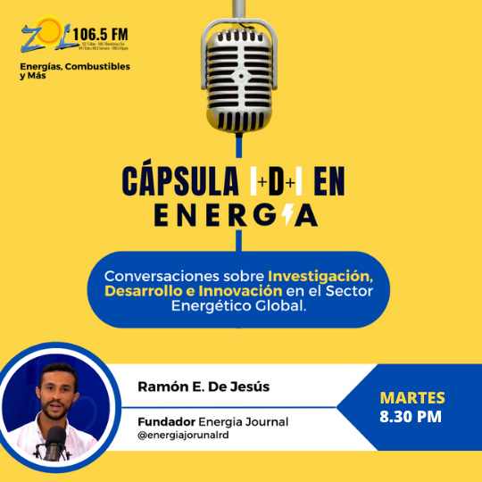

*El sector energético global se encuentra en un punto de inflexión bautizado como la transición energética. Las características principales de este movimiento se centran en las denominadas 3Dss -Descarbonización, Descentralización y Digitalización. Para que se de esta transición, el sector debe enfrentar una gran cantidad de desafíos regulatorios y tecnológicos, encontrando formas de usar y aplicar las últimas herramientas disponibles para resolverlos. En la capsula IDI en Energía (de las siglas Investigación, Desarrollo e Innovación) el equipo de Energía Journal traerá para los oyentes de Energía, Combustibles y Más - @energiacombustiblesymas en ZOL 106.5 FM, las informaciones más relevantes de esta transición.*  

---

