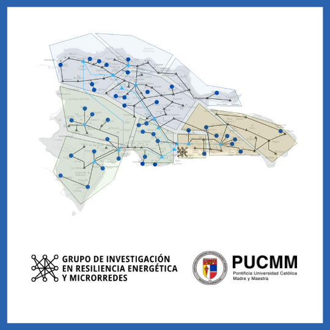

*Recent severe power outages caused by increasingly frequent climate-driven events have highlighted the urgency to improve grid resilience worldwide. Traditionally, the power industry has focused on methods that aim to restore loads by servicing the affected infrastructure and a gradual service restoration after a general blackout. However, when the distribution system is severely damaged traditional approaches cannot guarantee that energy will be supplied to much needed critical loads. Here is where microgrids (MGs) have emerged as a tool due to the potential to recover in an effective quick manner, providing an alternative approach to the resilience dilemma. The new paradigm presented by active MG integration to the grid required a robust modelling process and hardware testing, this research tackled both. Using the latest real-time (HIL) simulation platforms allowed for accurate representation of device integration and modeling. To the best of our knowledge, the PHIL testbed built at the Pontificia Universidad Católica Madre y Maestra (PUCMM), campus Santiago, is the first one developed in the country.*  

---

